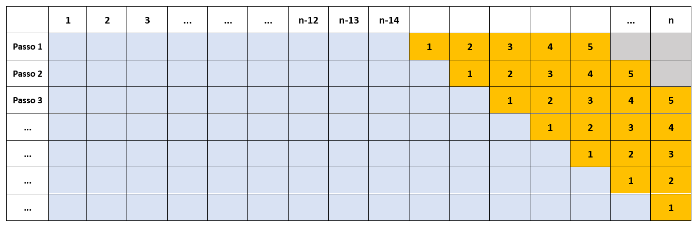

```{r setup, include=FALSE, echo=FALSE}
knitr::opts_chunk$set(echo = TRUE)
lapply(c('dplyr','lubridate','Mcomp','forecast','tseries','ggplot2','ggpubr','stringr','knitr'),require,character.only=TRUE)
# Dados
data(M3)
id <- 1686
serie = M3[[id]]$x
```


```{r global_options, include=FALSE}
knitr::opts_chunk$set(fig.pos = 'H')
```

# Apresentação

A série analisada consiste na série número `r id` pertencente ao banco de dados da competição de previsão M3, disponível no pacote *Mcomp* do software R. A série descreve o número de carregamentos com código _TD-AUTOUNITS_, mensalmente, de outubro de 1984 a setembro de 1993. 

```{r, fig.align="center",fig.cap='Comportamento da série ao longo do tempo',echo=FALSE}
M3[[id]] %>% plot(xlab="Ano", ylab="n.º de carregamentos")
```

# Decomposição MSTL

```{r,fig.align="center",fig.cap='Decomposição MSTL', echo = FALSE}
mstl(serie, s.window= c(12)) %>% 
  plot(main="Série Original")
```
A decomposição MSTL mostra os componentes de tendência, sazonalidade e erro da série estudada. Percebe-se a presença de uma tendência crescente, com múltiplas sazonalidades que apesentam mudança do comportamento ao longo do tempo. É possível observar, graficamente, um alargamento da sazonalidade ao fim da série quando comparando ao início da série. 

# Modelos ARIMA

A presença do componente de tendência explicita a não-estacionaridade da série original.A função ndiffs() é utilizada para estimar o número de diferenças exigidas para tornar a série estacionária por meio de um teste de raíz unitária, com a hipótese nula de que a série tem raízes estacionárias contra a hipótese alternativa de que a série tem raíz unitária. O teste retorna o menor número de diferenças exigidas para o teste em um nível de significância de 95%. Já a função nsdiffs() utiliza testes de raíz unitária para determinar o número de diferenças sazonais para tornar a série estacionária. 

Com o uso das funções acima, obteve-se o valor para $d = 1$ e $D = 0$. Os modelos candidatos terão a forma:

$$SARIMA(p, 1, q) \times (P, 0, Q)_{12}$$

```{r, echo = FALSE, include = FALSE, echo = FALSE}
serie %>%
  ndiffs()             # d = 1

serie %>%
  diff() %>%
  nsdiffs()            # D = 0

serie_dif <- serie %>% 
  diff() 
```

A estacionariedade da série pode ser testada utilizando o teste Kwiatkowski-Phillips-Schmidt-Shin (KPSS), com a hipótese nula de que a série é estacionária. O teste resulta em um valor de `r kpss.test(serie_dif)[[1]]`, com p-valor de `r kpss.test(serie_dif)[[3]]`, que não nos permite rejeitar a hipótese nula a um nível de significância $\alpha = 0,05$.

```{r, include = FALSE}
kpss.test(serie_dif)
```
Consideramos que a série é, agora, estacionária, observamos os gráficos da função de autocorrelação (ACF) e da função de autocorrelação parcial (PACF) em busca de possíveis autocorrelações entre os diferentes atrasos da série. Os gráficos a seguir ilustram a série diferenciada, assim como os gráficos das funções de ACF e PACF.

```{r, fig.align="center",fig.cap='Gráficos ACF e PACF', echo = FALSE}

par(mfrow=c(3,1),mar=c(4, 3, 3, 1) + 0.5)
plot(serie_dif,main="Série diferenciada")
acf(serie_dif, lag = 5*12, main="ACF") 
pacf(serie_dif, lag = 5*12, main="PACF")
```
Dos gráficos apresentados, pode-se afirmar que a série diferenciada não apresenta um padrão claro de autocorrelações simples e sazonais que permita inferir diretamente a modelagem. Neste sentido, serão testados valores diferentes para *p*, *P*, *q* e *Q* e os diferentes modelos serão comparados por meio do critério AIC.

Para os diferentes valores de $(p,q,P,Q)$ teremos:

```{r, echo = FALSE}
melhor_AICc = Inf
for (P in 0:1) { 
  for (Q in 0:1) {
    for (p in 0:3) { 
      for (q in 0:3) {
        fit = Arima(serie, order=c(p,1,q), seasonal=c(P,0,Q))
        if (fit$aicc < melhor_AICc) { 
          melhor_AICc = fit$aicc
          cat("p =",p,", q =",q,", P =",P,", Q =",Q,", AICc =", fit$aicc, "\n")
        }
      }
    }
  }
}
```
O modelo com menor AICc foi o $SARIMA(1,1,1) \times (1,0,1)_{12}$. 

Os coeficientes do modelo proposto, portanto, serão obtidos do cálculo da função Arima com o modelo acima proposto. Os coeficientes do modelo terão a seguinte forma:

```{r, include = FALSE}
fit_arima <- Arima(serie, order=c(1,1,1), seasonal=c(1,0,1))
fit_arima
```


$$\phi_1 = 0,3152; \theta_1 = -0,9218; \varphi = 0,9606; \vartheta = -0,7359$$
Para o modelo ARIMA utilizando transformação Box-Cox, os valores para *d* e *D* utilizando as funções _ndiffs()_ e _nsdiffs()_ são, respectivamente, *1* e *0*. De acordo com o teste KPSS, não se pode rejeitar a hipótese nula da série transformada ser estacionária (KPSS = 0.021624 e p-valor = 0.1). O valor do parâmetro $\lambda$ da transformação de Box-Cox é 0.09559902.
```{r, include=FALSE}
BoxCox.lambda(M3[[id]]$x)
serie_box_cox <- BoxCox(M3[[id]]$x, lambda = "auto")

serie_box_cox %>%
  ndiffs()             # d = 1

serie_box_cox %>%
  diff() %>%
  nsdiffs()            # D = 0

serie_box_cox_dif <- serie_box_cox %>% 
  diff() 

# Teste de estacionariedada da série diferenciada
kpss.test(serie_box_cox_dif)
```

```{r, fig.align="center",fig.cap='Gráficos ACF e PACF da série transformada (BoxCox)', echo = FALSE}
par(mfrow=c(3,1),mar=c(4, 3, 3, 1) + 0.5)
plot(serie_box_cox_dif,main="Série diferenciada", ylab = "", xlab = "")
acf(serie_box_cox_dif, lag = 5*12, main="ACF", ylab = "") 
pacf(serie_box_cox_dif, lag = 5*12, main="PACF", ylab = "")
```
A análise gráfica da funções de autocorrelação e autocorrelação da série transformada não permite a inferência a respeito de seus parâmetros de maneira clara. Procede-se a pesquisa de valores de p, q, P e Q de forma manual de acordo com o critério de AICc.

```{r, echo = FALSE}
melhor_AICc = Inf
for (P in 0:1) { 
  for (Q in 0:1) {
    for (p in 0:3) { 
      for (q in 0:3) {
        fit = Arima(serie, order=c(p,1,q), seasonal=c(P,0,Q), lambda = 'auto')
        if (fit$aicc < melhor_AICc) { 
          melhor_AICc = fit$aicc
          cat("p =",p,", q =",q,", P =",P,", Q =",Q,", AICc =", fit$aicc, "\n")
        }
      }
    }
  }
}
```

Para a série transformada, temos que o menor nível de AICc foi encontrado com os parâmetros $p = 3$, $q = 3$, $P = 1$ e $Q = 1$, cujo modelo pode ser descrito por $SARIMA(3,1,3) \times (1,0,1)_{12}$, com coeficientes iguais a: 

```{r, include = FALSE}
lambda_boxcox = BoxCox.lambda(serie)
fit_arima_boxcox = Arima(serie,order=c(3,1,3),seasonal=c(1,0,1), lambda = "auto")
fit_arima_boxcox
```


$$\phi_1 = 1,2866; \phi_2=-1,0479; \phi_3=0,2771; \theta_1 = -2,0555; \theta_2 = 2,0480. \theta_3 = -0,9371; \varphi = 0,9995; \vartheta = -0,9649$$

## Análise de Resíduos

Os resíduos do modelo ARIMA sem transformação apresentam o seguinte comportamento gráfico:

```{r fig.align="center",fig.cap='Resíduos ARIMA sem transformação', echo = FALSE}
par(mfrow=c(2,2))
plot(fit_arima$residuals, ylab = "Resíduos", xlab = "")
acf(fit_arima$residuals, main="")
pacf(fit_arima$residuals, main="")
qqnorm(fit_arima$residuals, main="")
qqline(fit_arima$residuals)
```
Já os resíduos do modelo ARIMA com transformação Box-Cox apresentam o seguinte comportamento gráfico:

```{r fig.align="center",fig.cap='Resíduos ARIMA com transformação boxcox', echo = FALSE}
par(mfrow=c(2,2))
plot(fit_arima_boxcox$residuals, ylab = "Resíduos", xlab = "")
acf(fit_arima_boxcox$residuals, main="", xlab="")
pacf(fit_arima_boxcox$residuals, main="", xlab="")
qqnorm(fit_arima_boxcox$residuals, main="", xlab="")
qqline(fit_arima_boxcox$residuals)
```

Graficamente, observa-se que os resíduos de ambos os modelos parecem distribuir-se simetricamente ao retor da origem e não apresentam autocorrelações bem definidas. Precisa-se, entretanto, testá-los para estacionariedade, independência e distribuição normal. Essas hipóteses serão testadas conforme se segue, todas assumindo nível de significância $\alpha = 0.05$.

A estacionaridade será testada a partir do teste Kwiatkowski-Phillips-Schmidt-Shin (KPSS), com a hipótese nula de que a série é estacionária. O teste para o modelo $SARIMA(1,1,1) \times (1,0,1)_{12}$ e para o mesmo modelo, utilizando a transformação de Box-Cox:

| Modelo | KPSS | P-valor |
|:---:|:---:|:---:|
| SARIMA sem Box-Cox | `r kpss.test(fit_arima$residuals)[[1]]` | `r kpss.test(fit_arima$residuals)[[3]]` |
| SARIMA com Box-Cox | `r kpss.test(fit_arima_boxcox$residuals)[[1]]` | `r kpss.test(fit_arima_boxcox$residuals)[[3]]` |

De acordo com o teste KPSS, não se pode rejeitar a hipótese de estacionariedade dos resíduos de ambos os modelos. 

O teste de independência dos resíduos é realizado a partir do teste Ljung-Box, com a hipótese $H_0$ de que os resíduos são idenpendentemente distribuídos. O teste apresenta os seguintes valores para os dois modelos:

| Modelo | Chi-Quadrado | Graus de liberdade | P-valor |
|:---:|:---:|:---:|:---:|
| SARIMA sem Box-Cox | `r Box.test(fit_arima$residuals, lag = 15, type ="Ljung-Box")[[1]]` | `r Box.test(fit_arima$residuals, lag = 15, type ="Ljung-Box")[[2]]` | `r Box.test(fit_arima$residuals, lag = 15, type ="Ljung-Box")[[3]]` |
| SARIMA com Box-Cox | `r Box.test(fit_arima_boxcox$residuals, lag = 15, type ="Ljung-Box")[[1]]` | `r Box.test(fit_arima_boxcox$residuals, lag = 15, type ="Ljung-Box")[[2]]` | `r Box.test(fit_arima_boxcox$residuals, lag = 15, type ="Ljung-Box")[[3]]` |

```{r, include = FALSE}
Box.test(fit_arima$residuals, lag = 15, type ="Ljung-Box")[[3]]
```
Os resultados acima mostram que a independência dos resíduos não pode ser rejeitada ao nível de significância de 5% em ambos os modelos. 

A normalidade dos resíduos é testada com o teste Shapiro-Wilk de Normalidade, com $H_0$ de que os resíduos apresentam distribuição normal. O valor do teste estatístico para os dois modelos trabalhados é:

| Modelo | W | P-valor |
|:---:|:---:|:---:|
| SARIMA sem Box-Cox | `r shapiro.test(fit_arima$residuals)[[1]]` | `r shapiro.test(fit_arima$residuals)[[2]]` |
| SARIMA com Box-Cox | `r shapiro.test(fit_arima_boxcox$residuals)[[1]]` | `r shapiro.test(fit_arima_boxcox$residuals)[[2]]` |

Do resultado acima, não se pode rejeitar a hipótese de normalidade dos resíduos de ambos os modelos, com nível de significância de 5%. 

```{r, include = FALSE}
shapiro.test(fit_arima$residuals)[[2]]
```

# Modelos ETS

O modelo ETS (Error, trend and seasonal) permite descrever os modelos de alisamento exponencial em função dos tipos de suas componentes: tendência, sazonalidade e erro. O modelo utiliza três caracteres como identificação de acordo com a terminologia adotada por Hyndman et al. (2002) e Hyndman et al. (2008). A primeira letra se refere ao componente do erro; a segunda, ao componente da tendência e a terceira, da sazonalidade. A série anteriormente descrita apresenta tendência e sazonalidade claras à decomposição realizada e, portanto, trabalharemos com componentes de modelagem que contenham essas características. 

Os modelos que apresentam as características observadas na decomposição e seus respectivos AICcs, considerando um modelo não transformado e um modelo com transformação de Box-Cox, estão representados na tabela abaixo:

| Parâmetros | AICc Modelo sem Box-Cox | AICc Modelo com Box-Cox |
|:---:|:---:|:---:|
| AAA | 1950.568 | 290.3203 |
| AAA Dumped | 1953.429 | 295.7952 |
| MAA | 1947.757 | 288.9366 |
| MAA Dumped | 1942.956 | 297.1602 |
| MAM | 1925.053 | 292.4207 |
| MAM Dumped | 1928.537 | 291.7428 |
| MMM | 1923.268 | 300.8768 |
| MMM Dumped | 1928.128 | 293.2297 |

O modelo com menor AICc e, portanto, o modelo com melhor desempenho comparativo, para o modelo não transformado é o "*MMM*", em que apresenta componentes multiplicativos para previsões de erros, tendência e sazonalidade. Já para o modelo com transformação de Box-Cox, o modelo com menor AICc é o "*MAM*" *com dumped*. 
```{r, include = FALSE}
fit_ets <- ets(serie, model = "MMM", damped = FALSE)
fit_ets_boxcox <- ets(serie,lambda = "auto", model = "MAM", damped = T)
```

O modelo selecionado sem transformação apresenta a seguinte estrutura:

$$
\begin{aligned}
\mu_t &= l_{t-1} b_{t-1}s_{t-m}\\
l_t &= l_{t-1}b_{t-1}+\frac{\alpha \epsilon_t}{s_{t-m}}\\
b_t &=b_{t-1}+\frac{\beta \epsilon_t}{s_{t-m}l_{t-1}} \\
s_t &=s_{t-m} + \frac{\gamma \epsilon_t}{l_{t-1}b_{t-1}}
\end{aligned}
$$
Enquanto o modelo selecionado para o conjunto de dados transformados por Box-Cox tem a seguinte estrutura:

$$
\begin{aligned}
\mu_t &= (l_{t-1} + \phi b_{t-1})s_{t-m}\\
l_t &= (l_{t-1} + \phi b_{t-1})(1+\alpha \epsilon_t)\\
b_t &=\phi  b_{t-1}+\beta (l_{t-1} + \phi b_{t-1})\epsilon_t  \\
s_t &=s_{t-m} (1 + \gamma \epsilon_t)
\end{aligned}
$$

A decomposição do modelo ETS "MMM" e do modelo ETS "MAM com Dumped" e transformação de Box-Cox são ilustrados abaixo.

```{r, fig.align="center", fig.cap="Decomposição ETS", echo = FALSE}
par(mfrow=c(1,2))
plot(fit_ets, xlab = "Decomposição ETS")
plot(fit_ets_boxcox, xlab = "Decomposição ETS com box-cox")
```

## Resíduos

Os resíduos do modelo ETS sem transformação selecionado são ilustrados na figura a seguir:

```{r, fig.align="center", fig.cap="Análise de Resíduos do ETS", echo = FALSE}
residuo_ets <- fit_ets$residuals
par(mfrow=c(2,2)); 
plot(residuo_ets, xlab = "Resíduos", ylab = "");
acf(residuo_ets, main="", ylab="", xlab="ACF");
pacf(residuo_ets, main="", ylab="", xlab="PACF");
qqnorm(residuo_ets, main="", xlab = "Gráfico QQ", ylab="");qqline(residuo_ets)
```
Enquanto os gráficos para o modelo ETS selecionado usando tranformação de Box-Cox são ilustrados abaixo:


```{r, fig.align="center", fig.cap="Análise de Resíduos do ETS do modelo com Box-Cox", echo = FALSE}
residuo_ets_boxcox <- fit_ets_boxcox$residuals
par(mfrow=c(2,2)); 
plot(residuo_ets_boxcox, xlab = "Resíduos", ylab = "");
acf(residuo_ets_boxcox, main="", ylab="", xlab="ACF");
pacf(residuo_ets_boxcox, main="", ylab="", xlab="PACF");
qqnorm(residuo_ets_boxcox, main="", xlab = "Gráfico QQ", ylab="");qqline(residuo_ets_boxcox)
```


```{r, include = FALSE}
kpss_ets = kpss.test(residuo_ets)
box_ets = Box.test(residuo_ets, lag = 20, type ="Ljung-Box")
shap_ets = shapiro.test(residuo_ets)
kpss_ets_boxcox = kpss.test(residuo_ets_boxcox)
box_ets_boxcox = Box.test(residuo_ets_boxcox, lag = 20, type ="Ljung-Box")
shap_ets_boxcox = shapiro.test(residuo_ets_boxcox)
kpss_ets
kpss_ets_boxcox
box_ets
box_ets_boxcox
shap_ets
shap_ets_boxcox
```

Observa-se que os resíduos parecem comportar-se de maneira aleatória, com distribuição normal e sem autocorrelações importantes entre diferentes intervalos. Os testes formais encontram-se na tabela abaixo, a exemplo do anteriormente realizado:

| Teste | MMM sem dumped | p-valor | MAM com dumped Box-Cox | p-valor |
|:---:|:---:|---|:---:|---|
| KPSS | 0.12301 | 0.1 | 0.2145 | 0.1 |
| Ljung-Box | 25.522 | 0.038 | 41.505 | 0.003 |
| Shapiro-Wilk | 0.98751 | 0.416 | 0.99443 | 0.944 |

Os resultados acima apresentados sugerem que os resíduos do modelo são estacionários, apresentam distribuição normal, entretanto, é possível a rejeição da hipótese nula de independência em ambos os casos. 


# Estudo de desempenho preditivo por janela deslizante

Considerante os dois modelos ARIMA e os dois modelos ETS anteriormente escolhidos, será realizado um estudo de desempenho preditivo por janela deslizante para a série M3 com ID `r id` com conjunto de treino consistindo nos últimos 14 períodos e considerando um horizonte preditivo de até 5 meses a frente. Para tal será utilizado a função tsCV, que calcula os erros de previsão obtidos aplicando a função de previsão a subconjuntos da série temporal, conforme ilustrado na figura abaixo. Os modelos utilizados para previsão são aqueles apresentados anteriormente: ARIMA, ARIMA com  Box-Cox, ETS e ETS com box-cox. 



```{r, echo = FALSE}
# Definindo as funções de previsão:
f_arima <- function(y, h){
  forecast(fit_arima, h)
}
f_arima_boxcox <- function(y, h){
  forecast(fit_arima_boxcox, h,lambda = lambda_boxcox)
}
f_ets <- function(y, h){
  forecast(fit_ets, h)
}
f_ets_boxcox <- function(y, h){
  forecast(fit_ets_boxcox, h, lambda = lambda_boxcox)
}

# Calculo dos erros de previsão com a janela flutuante
CV_arima = tsCV(y=serie, 
                forecastfunction=f_arima, 
                h=5, 
                init = length(serie)-14)
CV_arima_boxcox = tsCV(y=serie, 
                       forecastfunction=f_arima_boxcox, 
                       h=5, 
                       init = length(serie)-14)
CV_ets = tsCV(y=serie, 
              forecastfunction=f_ets, 
              h=5, 
              init = length(serie)-14)
CV_ets_boxcox = tsCV(y=serie, 
                     forecastfunction=f_ets_boxcox, 
                     h=5,
                     init = length(serie)-14)

# Calculo da métrica de erro para cada horizonte de previsão
# por erro absoluto médio (MAE)
MAE_arima = CV_arima %>% abs() %>% colMeans(na.rm=T)
MAE_arima_boxcox = CV_arima_boxcox %>% abs() %>% colMeans(na.rm=T)
MAE_ets = CV_ets %>% abs() %>% colMeans(na.rm=T)
MAE_ets_boxcox = CV_ets_boxcox %>% abs() %>% colMeans(na.rm=T)
tab = cbind(MAE_arima, MAE_arima_boxcox, MAE_ets, MAE_ets_boxcox); 
```
Para comparação dos resultados, foi calculado o erro absoluto médio (MAE) para horizonte de previsão.

```{r, echo = FALSE}
tab2 <- tab
colnames(tab2) <- c('ARIMA', 'ARIMA Box-Cox', 'ETS', 'ETS Box-Cox')

kableExtra::kable(tab2 ,"latex", booktabs=T,
                  escape = F,align = "c",
                  caption = "Erro absoluto médio") %>%
  kableExtra::kable_styling(position = "center", 
                            latex_options = "HOLD_position") %>% 
  kableExtra::row_spec(2:dim(tab2)[2], extra_css = "border-bottom-style: none")
```


```{r, fig.align="center", fig.cap="Erros absolutos médios a cada horizonte de previsão", echo = FALSE}
# Construir um gráfico com os horizontes no eixo x e a métrica no eixo y
plot.ts(tab, plot.type='s', col=1:5, lwd=c(2,2), xlab="h",ylab="MAE")
legend(x=1,y=1200, legend=c("ARIMA", "ARIMA com  Box-Cox", "ETS", "ETS com  Box-Cox"), col=1:4, lwd=c(2,2), cex=1)
```

# Resultados

## Gráfico com as previsões de cada modelo
```{r, out.width = "60%"}
h = 5

plot(f_arima(serie,h));plot(f_arima_boxcox(serie,h));
plot(f_ets(serie,h));
plot(f_ets_boxcox(serie,h))


ets(serie,model="MAM",lambda = "auto")


```


Comparando os 4 modelos estimados anteriormente com os seguintes modelos: Auto Arima, SES, Holt, Auto ETS, STLF, Bats, Tbats, temos os seguintes da métrica MAE, no conjunto de testes:

```{r, echo=F, warning=F}

#comparar os 4 modelos com os modelos abaixo

dados_teste =  M3[[id]]$xx

f_arima = fit_arima %>% forecast(h=h) %>% accuracy(dados_teste)
f_arima_boxcox = fit_arima_boxcox %>% forecast(h=h) %>% accuracy(dados_teste)
f_ets = fit_ets %>% forecast(h=h) %>% accuracy(dados_teste)
f_ets_boxcox = fit_ets_boxcox %>% forecast(h=h, lambda = lambda_boxcox) %>% accuracy(dados_teste)
f_auto_arima = auto.arima(serie) %>% forecast(h=h) %>% accuracy(dados_teste)
f_ses = ses(serie, h=h)  %>% forecast(h=h) %>% accuracy(dados_teste)
f_holt = holt(serie, h=h) %>% forecast(h=h) %>% accuracy(dados_teste)
f_auto_ets = ets(serie) %>% forecast(h=h) %>% accuracy(dados_teste)
f_stlf = stlf(serie, h=h) %>% forecast(h=h) %>% accuracy(dados_teste)
f_bats = bats(serie) %>% forecast() %>% accuracy(dados_teste)
f_tbats = tbats(serie) %>% forecast() %>% accuracy(dados_teste)

acuracia <- rbind(f_arima[2,3],
                  f_arima_boxcox[2,3],
                  f_ets[2,3],
                  f_ets_boxcox[2,3],
                  f_auto_arima[2,3],
                  f_ses[2,3],
                  f_holt[2,3],
                  f_auto_ets[2,3],
                  f_stlf[2,3],
                  f_bats[2,3],
                  f_tbats[2,3])

modelos = c("ARIMA","ARIMA com  Box-Cox","ETS",
            "ETS com  Box-Cox","Auto ARIMA","SES",
            "Holt","Auto ETS","STLF","Bats","Tbats")

resultados = cbind(modelos, round(acuracia,3))

kableExtra::kable(resultados,"latex", booktabs=T,
                  col.names = c("Modelos", "MAE"),
                  escape = F,align = "c",
                  caption = "Comparação do Erro absoluto médio com todos os modelos") %>%
  kableExtra::kable_styling(position = "center",
                            latex_options = "HOLD_position") %>% 
  kableExtra::row_spec(2:11, extra_css = "border-bottom-style: none")
```

O modelo ETS(M,M,M) foi o que obteve o menor MAE no conjunto de teste, apresentando um valor igual a 
`r round(f_ets[2,3],3)`.
